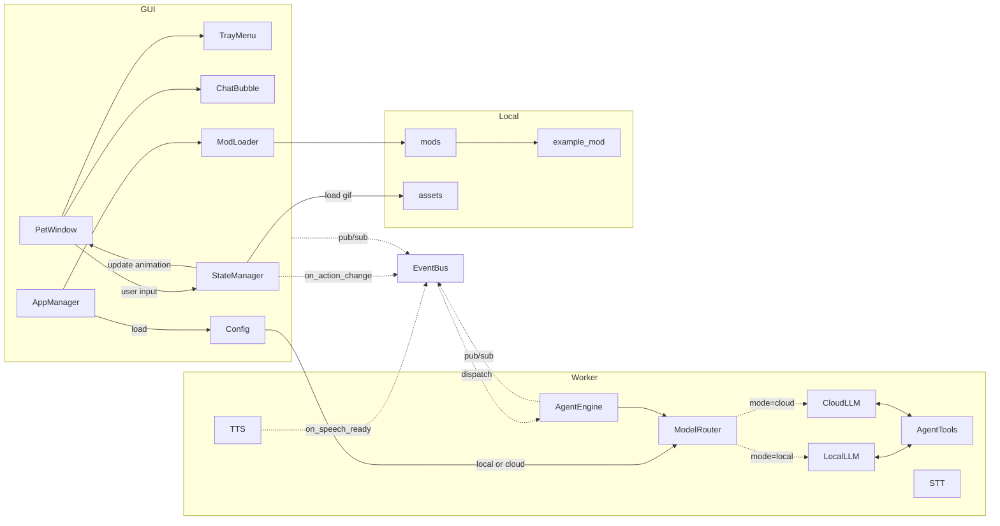

# Desktop Pet Implementation Plan

## 目标说明 (Goal Description)
为主人实现一个基于 Python 和 PySide6 的桌面宠物窗口，初期满足无边框、背景完全透明、并在 Windows 上永远置顶的核心视觉需求，加载本地 `parrot_idle.gif`；同时在架构层面，对标优秀的开源桌面宠物软件，设计高度可扩展的分层框架（UI 层、内核层、接口层）。以便主人后续无缝接入各种 AI 大模型 API、系统功能 API 以及其他众多能力接口。

## 架构设计 (Architecture Design)

为了遵循事实为本并保持代码整洁（避免后期逻辑揉成一团），核心采用 **MVC 思想的分层架构**：分离展示层（PySide6）、核心逻辑状态管理以及第三方接口抽象。

## User Review Required
> [!IMPORTANT]
> 主人请确认下方的目录结构与架构分层是否符合您的期望。所有的抽象层基类我都会在第一版的预留文件夹里空置出来，方便主人随时补充具体实现！

## 拟定开发目录结构与变更 (Proposed Changes)

规划工作目录：`d:\Desk\Daily\Work\EchoMate`

### [文档模块]
#### [NEW] `README.md`
提供环境配置、依赖安装指南（如 `pip install -r requirements.txt`）以及模块化架构的思想说明，方便二次开发接手。
#### [NEW] `requirements.txt`
包含 `PySide6`及其他后续可能使用到的基础请求库（如 `requests`）。

### [代码模块]
将从单文件演进为模块化的包管理结构，初期以基础框架为主：

#### 1. 入口文件
#### [NEW] `main.py`
初始化应用的配置，实例化核心控制器并启动 PySide6 事件循环。

#### 2. UI 视觉交互层 (UI Layer)
#### [NEW] `ui/__init__.py`
#### [NEW] `ui/pet_window.py`
继承 `QWidget`，使用掩码（在 Windows 上优化 `Tool` 等置顶特性）与 `WA_TranslucentBackground`。绑定动图加载，重写 `mousePressEvent` 和 `mouseMoveEvent` 实现随意拖拽。
#### [NEW] `ui/tray_menu.py`
创建右键弹出菜单，绑定“退出嘎！”以及其他系统托盘事件。

#### 3. 事件总线与核心控制层 (Core Layer)
#### [NEW] `core/__init__.py`
#### [NEW] `core/event_bus.py`
全局消息中心，基于 PySide6 的 `Signal` 封装（如 `on_speech_ready`, `on_action_change`），彻底解耦各个大模块（如发音和界面切换）。必须作为全局 `QObject` 单例设计，所有异步 Worker 线程的数据流转必须且只能通过触发 EventBus 的信号（Signal）来通知主 GUI 线程更新（Slot），坚决不允许在子线程直接操作 UI，以确保线程安全。
#### [NEW] `core/app.py`
应用程序的单例主控，负责初始化环境、载入配置，并注册所有的核心订阅者/发布者实例。
#### [NEW] `core/state_manager.py`
包含维护状态数据的逻辑，负责收到数据后反向发送更新 UI 的回调。
#### [NEW] `core/mod_loader.py`
热插拔插件加载器。
#### [NEW] `core/agent_engine.py` （异步线程区）
包含请求调度队列，它的 **Router 模块** 在初始化时读取全局配置，决定实例化“本地推理”还是“云端API”，作为唯一的 LLM 后端为工具调用和对话提供算力。在工作线程运行，不阻塞主 GUI 线程。
#### [NEW] `core/config.py`
统一管理配置，特别是 `model_mode = "local" | "cloud"` 的全局开关。

#### 3. 能力与接口层 (API Layer - 异步实现)
暂作占位符和基类预设，所有的网络或推理调用均需设计在后台线程抛出，并最终通过事件总线与前台通讯。
#### [NEW] `ai_services/__init__.py`
#### [NEW] `ai_services/local_llm_api.py` 
结合 `llama-cpp-python` 的大模型机制，响应简单指令并使用 GBNF 控制输出。
#### [NEW] `ai_services/cloud_llm_api.py`
对接云端 OpenAI 格式服务（大模型脑），接收从 Router 抛来的高复杂度长流程任务。
#### [NEW] `ai_services/agent_tools.py`
具体工具类基类与基础实现（如 `TimerTool`）。
#### [NEW] `ai_services/tts_service.py`
发声模块，独立注册事件监听器，监听到 `on_speech_ready` 事件即默默开始合成与播放。

#### 5. MOD与插件扩展层 (Mod Layer)
#### [NEW] `mods/` 
存放将来第三方社区或者自行编写的功能增强包。
#### [NEW] `mods/example_mod/`
内置一个最小示例 MOD，展示插件的标准接口规范（如必须实现的 `register()` / `unregister()` 生命周期钩子），让社区开发者仿照编写。

#### 6. 资源模块
#### [NEW] `assets/parrot_idle.gif` （所需资源目录）

## 验证计划 (Verification Plan)
### Manual Verification
手动测试步骤如下：
1. 根据 README 进行依赖安装，运行 `main.py` 确认项目能否通过模块化结构成功启动。
2. 观察无边框且全透明背景的主窗口（在 Windows 下的置顶效果如何，是否有黑边残影）。
3. 测试鼠标能否自由拖拽以及呼出包含“退出嘎！”的菜单并执行。
4. 审查目录结构，确认各接口文件层级清晰、互不耦合。
5. 验证事件总线：打印一条测试信号，确认发布端和订阅端能正常收发消息。
